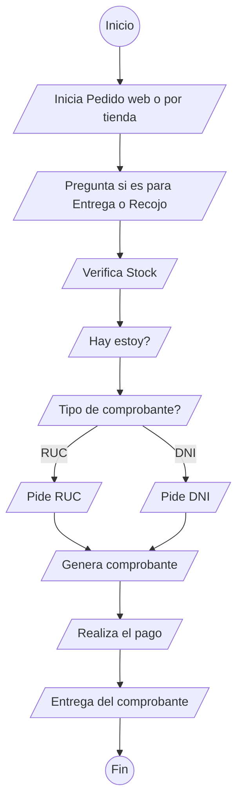
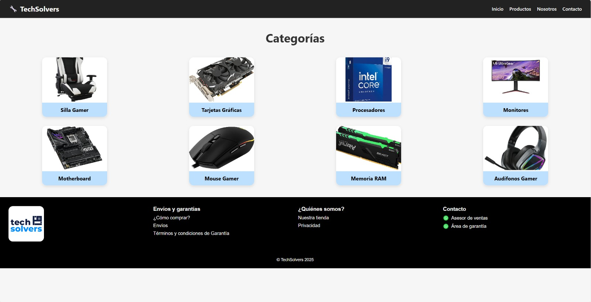
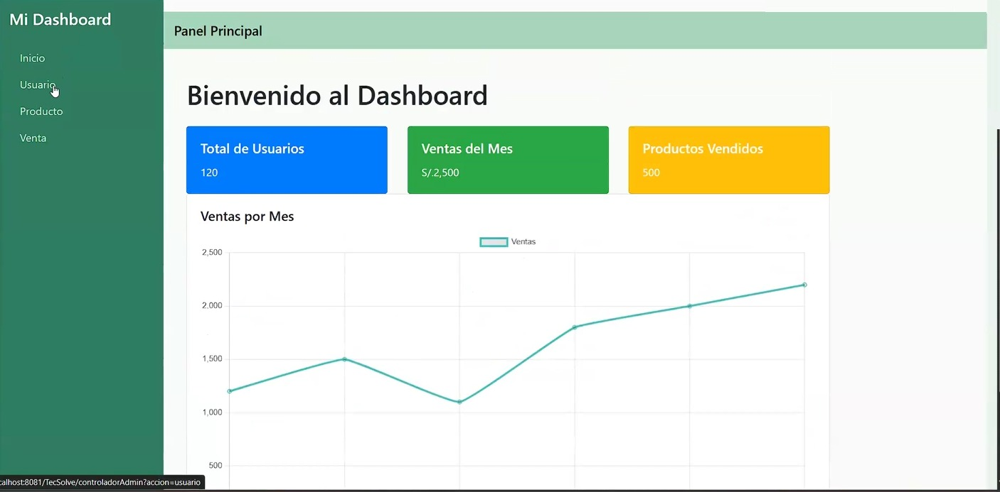
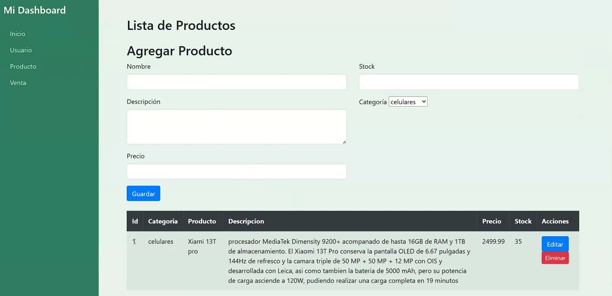
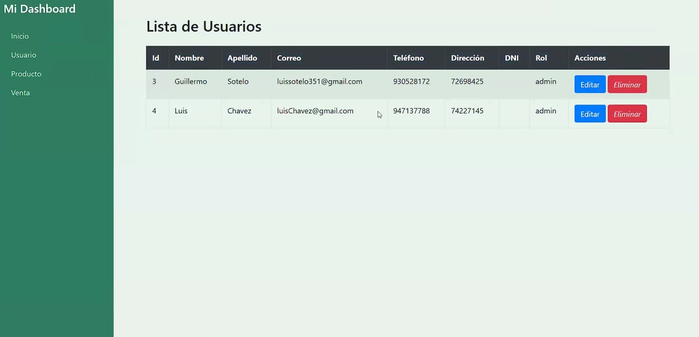

# Aplicación Web para TECSOLVE

## 👥 Integrantes

- **Meza Negreiros, Orlando** (U17208037) - GitHub: [Eznowy](https://github.com/Eznowy)
- **Bedon Silva, Yefli** (U22303932) - GitHub: [Yefli-Bedon-Silva](https://github.com/Yefli-Bedon-Silva)
- **Sotelo Chavez, Guillermo** (U21223156) - GitHub: [Luis-Sotelo-24](https://github.com/Luis-Sotelo-24)  
- **Mariano Asencio, Erick** (U21224667) - GitHub: [Erick00001](https://github.com/Erick00001)
- **Valverde Montes, Stefano** (U22228444) - GitHub: [GabrielSVM3905](https://github.com/GabrielSVM3905)

## 🧩 Descripción del Problema
**TECSOLVE** es una empresa que se posiciona en el mercado como una opción rápida y de calidad para aquellos usuarios que desean comprar aparatos electrónicos.

Actualmente, la empresa presenta las siguientes necesidades:

- Diversificación de productos  
- Control de stock  
- Integración a un sistema de facturación  
- Servicio de delivery  
- Competitividad agresiva en el sector  
- Actualización de protocolos de seguridad  

## 🎯 Objetivo del Proyecto
Desarrollar una solución web completa que permita:

- Gestionar el catálogo de productos  
- Controlar inventario  
- Registrar clientes  
- Facilitar el proceso de compra  
- Integrar un sistema de facturación  

## 💡 Funcionalidades Esperadas
- Registro y autenticación de usuarios  
- Visualización de productos con sus detalles  
- Carrito de compras  
- Gestión de stock por parte de los administradores  
- Generación de comprobantes de compra  
- Módulo de delivery (futuro)
- 
## 🛠️ Tecnologías Utilizadas

- **Lenguajes:** Java, HTML5, CSS3, JavaScript  
- **Librerías:**  
- **Backend:** Java, JSTL  
- **Frontend:** CSS3, Bootstrap 4.6  
- **Base de Datos:** MySQL  
- **Control de versiones:** Git / GitHub

## 📊 Diagrama de flujo



## 📌 Estado del Proyecto

🟢 En desarrollo

## 🗂 Estructura de la Página Web
- TECSOLVE [GuillermoSotelo t1]
  - Web Pages
    - META-INF
    - WEB-INF
    - vistas
      - imagenes
      - dashBoard.jsp
      - login.jsp
    - index.jsp
  - Source Packages
    - controladores
      - controladorLogin.java
  - Test Packages
  - Libraries
    - mysql-connector-java-8.0.30 - mysql-connector-java
    - JDK 23 (Default)
    - Apache Tomcat or TomEE
  - Test Libraries
  - Configuration Files


## 🚀 Instalación y Uso

1. Clona el repositorio:  
   ```bash
   git clone https://github.com/tu-usuario/tecsolve.git
   cd TECSOLVE
   ```

## 📸 Vistas

### Login


### Registro


### Categorías



### Productos


### Ubícanos


### Preguntas Frecuentes


### Dashboard



### Panel de Edición de Productos



### Lista de Nuestros Usuarios




## Diagrama de Base de datos


