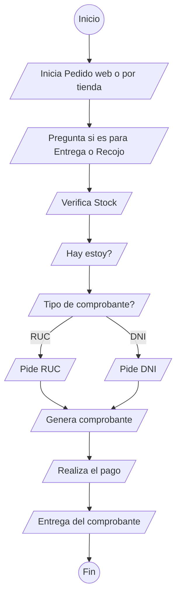
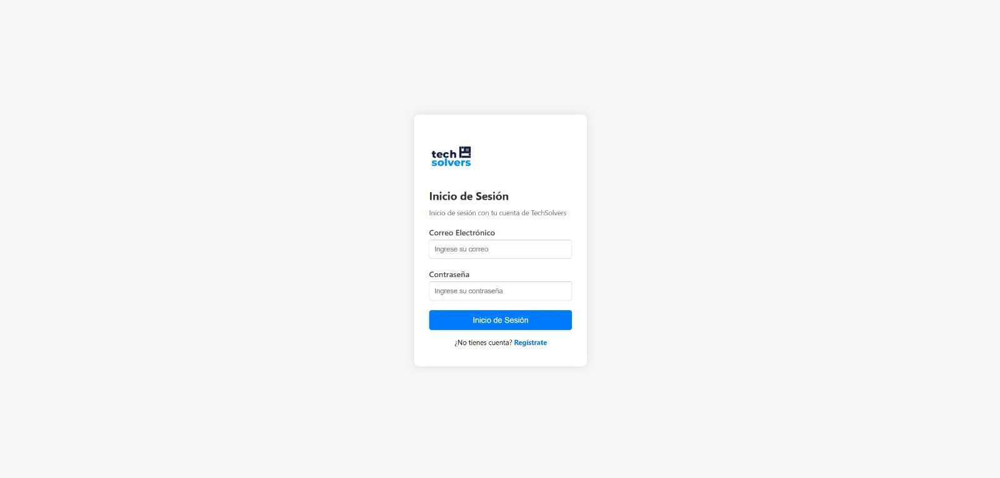
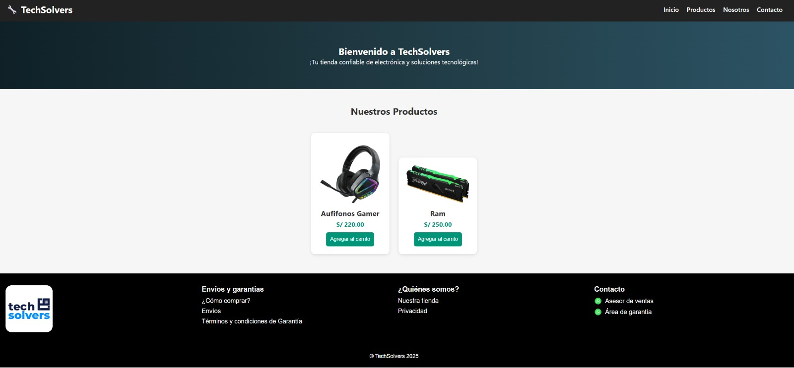
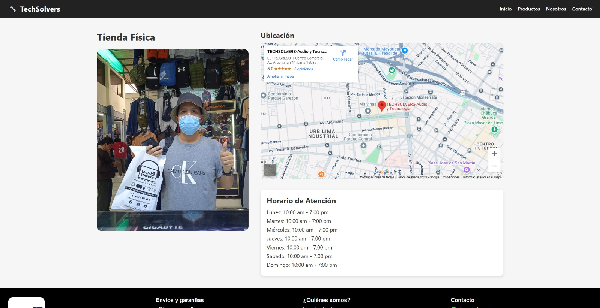
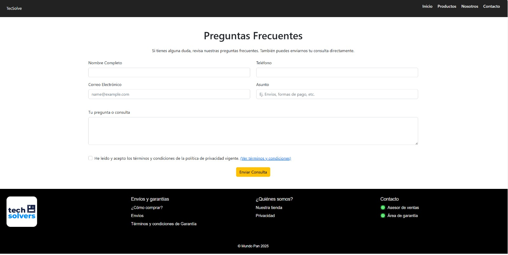

# Aplicación Web para TECSOLVE

## 👥 Integrantes

- **Meza Negreiros, Orlando** (U17208037) - GitHub: [Eznowy](https://github.com/Eznowy)
- **Bedon Silva, Yefli** (U22303932) - GitHub: [Yefli-Bedon-Silva](https://github.com/Yefli-Bedon-Silva)
- **Sotelo Chavez, Guillermo** (U21223156) - GitHub: [Luis-Sotelo-24](https://github.com/Luis-Sotelo-24)  
- **Mariano Asencio, Erick** (U21224667) - GitHub: [Erick00001](https://github.com/Erick00001)
- **Valverde Montes, Stefano** (U22228444) - GitHub: [GabrielSVM3905](https://github.com/GabrielSVM3905)

## 🧩 Descripción del Problema
**TECSOLVE** es una empresa que se posiciona en el mercado como una opción rápida y de calidad para aquellos usuarios que desean comprar aparatos electrónicos.

# Aplicación Web para Tecsolvers

## 👥 Integrantes

- **Meza Negreiros, Orlando**
- **Bedon Silva, Yefli** – U22303932 
- **Sotelo Chavez, Guillermo** – U21223156  
- **Mariano Asencio, Erick** – U21224667   
- **Valverde Montes, Stefano** – U22228444 

---

## 🧩 Descripción del Problema

**Tecsolve** es una empresa que se posiciona en el mercado como una opción rápida y de calidad para aquellos usuarios que desean comprar aparatos electrónicos.


Actualmente, la empresa presenta las siguientes necesidades:

- Diversificación de productos  
- Control de stock  
- Integración a un sistema de facturación  
- Servicio de delivery  
- Competitividad agresiva en el sector  
- Actualización de protocolos de seguridad  


## 🎯 Objetivo del Proyecto

---

## 🎯 Objetivo del Proyecto

Desarrollar una solución web completa que permita:

- Gestionar el catálogo de productos  
- Controlar inventario  
- Registrar clientes  
- Facilitar el proceso de compra  
- Integrar un sistema de facturación  

## 💡 Funcionalidades Esperadas
- Registro y autenticación de usuarios  
- Visualización de productos con sus detalles  
- Carrito de compras  
- Gestión de stock por parte de los administradores  
- Generación de comprobantes de compra  
- Módulo de delivery (futuro)
- 
---


## 🛠️ Tecnologías Utilizadas

- **Lenguajes:** Java, HTML5, CSS3, JavaScript  
- **Librerías:**  
- **Backend:** Java, JSTL  
- **Frontend:** CSS3, Bootstrap 4.6  
- **Base de Datos:** MySQL  
- **Control de versiones:** Git / GitHub

## 📊 Diagrama de flujo



## 📌 Estado del Proyecto

🟢 En desarrollo

## 🗂 Estructura de la Página Web
- TECSOLVE [GuillermoSotelo t1]
  - Web Pages
    - META-INF
    - WEB-INF
    - vistas
      - imagenes
        - audifonosgamer.webp
        - banderaPeru.png
        - graficartx.png
        - imagencomprador.jpg
        - logoWhatsapp.jpg
        - logotechsolve.jpg
        - monitor.avif
        - motherboard.webp
        - mousegamer.jpg
        - procesador.png
        - ram.png
        - sillagamer.png
        - tarjetagrafica.jpg        
      - FrmPreguntasFrecuente.html
      - categoria.html
      - contacto.jsp
      - dashBoard.jsp
      - index.jsp
      - login.jsp
      - logout.jsp
      - producto.jsp
      - registro.jsp
      - usuarios.jsp
      - venta.jsp
    - index.jsp
  - Source Packages
    - controlador
      - controladorLogin.java
      - controladorAdmin.java
      - controladorUsuario.java
    - dao
      - categoriaDao.java
      - productoDao.java
      - usuarioDao.java
    - entidades
      - bitacora.java
      - categoria.java
      - comentario.java
      - detalleVenta.java
      - estadoVenta.java
      - producto.java
      - usuario.java
      - venta.java
    - seguridad
      - authService.java
    - servicios
      - ConectaDB.java
  - Test Packages
  - Java Dependencies
    - JDK 23
    - jakarta.jakartaee-api-8.0.0.jar
  - Dependencies
    - mysql-connector-j-8.3.0.jar
    - jakarta.jakartaee-api-8.0.0.jar
    - jbcrypt-0.4.jar
    - jstl-1.2.jar
    - jstl-api-1.2.jar
    - JDK 23 (Default)
    - Apache Tomcat or TomEE
  - Test Libraries
  - Configuration Files

- **Control de versiones:** Git / GitHub  


## 💡 Funcionalidades Esperadas

- Registro y autenticación de usuarios  
- Visualización de productos con sus detalles  
- Carrito de compras  
- Gestión de stock por parte de los administradores  
- Generación de comprobantes de compra  
- Módulo de delivery (futuro)  
- Login con derivacion de usuario(admin y cliente)

## 📌 Estado del Proyecto

🟢 En desarrollo

## 🚀 Instalación y Uso

1. Clona el repositorio:  
   ```bash
   git clone https://github.com/tu-usuario/tecsolve.git
   cd TECSOLVE
   ```

## 📸 Vistas

### Login



### Registro


### Categorías


### Productos



### Ubícanos



### Preguntas Frecuentes



### Dashboard


### Panel de Edición de Productos


### Lista de Nuestros Usuarios


## Base de datos (Tablas)
create table categorias(
	idCategoria int auto_increment,
    nombreCategoria varchar(100),
    PRIMARY KEY (idCategoria)
);

create table estadoVenta (
	idEstado int auto_increment,
    descripcion varchar(50),
    PRIMARY KEY (idEstado)
);

create table usuario (
	idUsuario int AUTO_INCREMENT,    
    nombre varchar(100),
    apellido varchar(100),
    direccion varchar(500),
    telefono varchar(9),
    dni varchar(8),
    correo varchar(30),
    clave varchar(500),
    rol enum('admin','cliente'),
    fechaRegistro datetime,
    PRIMARY KEY(idUsuario)
);

create table producto(
	idProducto int auto_increment,
    idCategoria int,
    nombreProducto varchar(20),
    descripcion varchar (1000),
    precio decimal(10,2),
    stock int,
    imagenUrl varchar(255),
    PRIMARY KEY (idProducto),
    FOREIGN KEY (idCategoria) REFERENCES categorias(idCategoria)
);

create table ventas(
	idVenta int auto_increment,
    idUsuario int,
    idEstado int,
    fechaVenta datetime,
    totalVenta decimal(10,2),
    PRIMARY KEY (idVenta),
    FOREIGN KEY (idUsuario) REFERENCES usuario(idUsuario),
    FOREIGN KEY (idEstado) REFERENCES estadoVenta(idEstado)
);


create table detalleVenta (
	idDetalle int auto_increment,
    idVenta int,
    idProducto int,
    cantidad int,
    precioUnitario decimal(10,2),
    PRIMARY KEY (idDetalle),
    FOREIGN KEY (idVenta) REFERENCES ventas(idVenta),
    FOREIGN KEY (idProducto) REFERENCES producto(idProducto)
);

create table comentario (
	idComentario int auto_increment,
    idUsuario int,
    idProducto int,
    calificacion tinyint,
    opinion text,
    fechaComentario datetime,
    PRIMARY KEY (idComentario),
    FOREIGN KEY (idUsuario) REFERENCES usuario(idUsuario),
    FOREIGN KEY (idProducto) REFERENCES producto(idProducto)
);

create table bitacora (
	idBitacora int auto_increment,
    idUsuario int,
    accion varchar(255),
    fachaAccion datetime,
    PRIMARY KEY (idBitacora),
    FOREIGN KEY (idUsuario) REFERENCES usuario(idUsuario)
)


